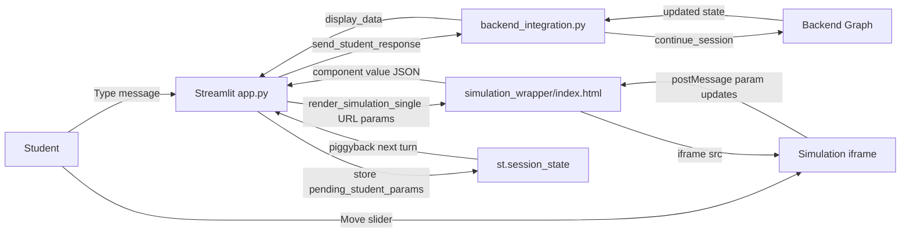
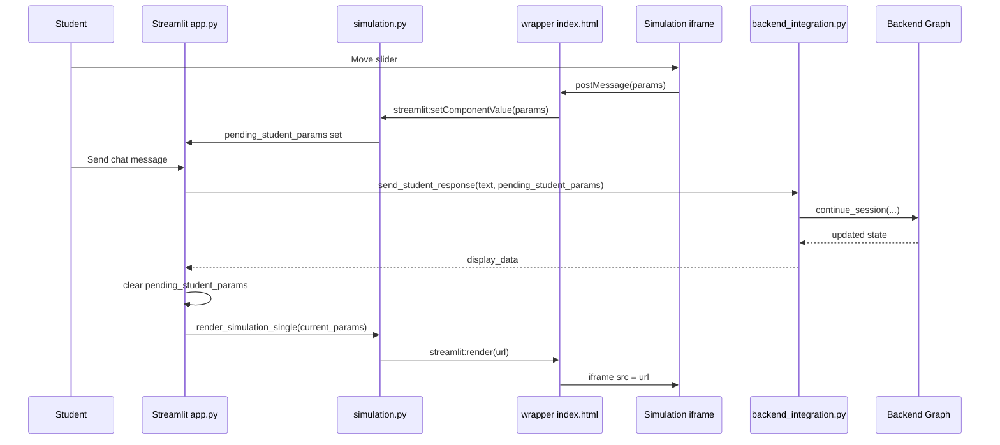
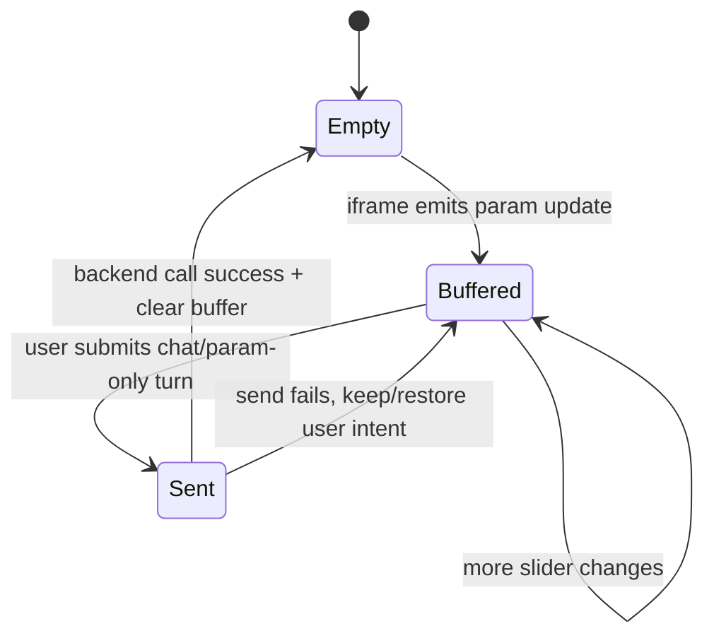

# Streamlit Frontend: Two-Way Communication (Simple Guide)

This README explains the Streamlit-side two-way communication in easy language.

What this file covers:
- How Streamlit talks to backend
- How Streamlit talks to simulation iframe
- Why this was tricky in real implementation
- What safeguards were added

What this file does not cover:
- Deep backend node logic (see root README)

## 1. Simple Idea

In Streamlit, two loops run at the same time:

1. Chat loop: Streamlit <-> backend
2. Simulation loop: Streamlit <-> iframe simulation

Both loops must stay in sync across Streamlit reruns.

## 2. Big Picture Diagram

## 3. Key Files (Who Does What)

- `streamlit_app/app.py`
  - Main app flow, session state, chat turns, simulation display
- `streamlit_app/backend_integration.py`
  - Calls backend, adapts backend state for UI
- `streamlit_app/components/simulation.py`
  - Python component wrapper, captures param changes from iframe
- `streamlit_app/components/simulation_wrapper/index.html`
  - JS bridge between Streamlit component protocol and iframe messages
- `streamlit_app/streamlit_config.py`
  - URL builder and per-simulation param mapping
- `streamlit_app/components/chat.py`
  - Chat rendering and message helpers

## 4. Main Flows

## A. Start Session Flow

1. User clicks start.
2. Streamlit calls `create_new_session(...)`.
3. Backend returns initial teacher state.
4. Streamlit stores `thread_id`, `backend_state`, `simulation_params`.
5. First teacher message is added to chat.

## B. Normal Student Turn Flow

1. Student types message.
2. Streamlit reads any buffered `pending_student_params`.
3. Streamlit sends both text and params to backend.
4. Backend returns updated state.
5. Streamlit updates chat, concept marker, simulation card, and params.
6. Streamlit clears `pending_student_params` after successful send.

## C. Iframe-to-Streamlit Param Flow

1. Student changes simulation slider in iframe.
2. Simulation posts message to parent.
3. Wrapper normalizes message format.
4. Wrapper sends JSON to Streamlit component value.
5. Python component stores cleaned params in `pending_student_params`.
6. Next user turn sends these params to backend.

## D. Streamlit-to-Iframe Param Flow

1. Streamlit gets params from backend state.
2. Streamlit builds simulation URL with those params.
3. Wrapper updates iframe `src` if URL changed.
4. Iframe loads with requested state.

## 5. Sequence Diagram: Full Turn

## 6. State Diagram: `pending_student_params`

## 7. Important Session Keys

- `thread_id`: current backend session
- `backend_state`: latest backend snapshot
- `simulation_params`: current params to render
- `chat_messages`: full UI chat timeline
- `pending_student_params`: buffered iframe param changes
- `last_concept_shown`: avoids duplicate concept markers

Most important key: `pending_student_params`.
Without this buffer, slider changes can be lost between reruns.

## 8. Why Building This Was Nuanced

## 8.1 Streamlit reruns are stateless per run

Nuance:
- UI reruns can happen before student presses send.
- Iframe messages are async.

What was done:
- Buffer slider changes in session state.
- Send them on the next explicit user turn.

## 8.2 Multiple simulation blocks exist in chat history

Nuance:
- Old chat messages may still render old iframes.
- If all were interactive, stale iframes could overwrite live params.

What was done:
- Only newest simulation block captures changes.
- Old blocks are read-only.

## 8.3 Component key collisions (`DuplicateWidgetID`)

Nuance:
- Repeated component renders need unique keys.

What was done:
- Use per-message unique key (`chat_<index>`).

## 8.4 Inconsistent message format from simulation HTML files

Nuance:
- Different simulation files emit different event shapes.

What was done:
- Wrapper normalizes all known formats into one clean params object.
- Unknown control messages are ignored.

## 8.5 Event noise and duplicates

Nuance:
- Same params can arrive repeatedly.
- Internal control payloads can pollute data.

What was done:
- Strip control keys like `cmd` and cache-busting `__t`.
- Keep last-seen value cache and update only on real change.

## 8.6 Avoiding stale simulation cards

Nuance:
- Showing simulation on every teacher message causes noise.

What was done:
- Respect backend `show_simulation` semantics.
- Attach simulation card only when that turn is display-worthy.

## 8.7 Language support without breaking logic

Nuance:
- UI can be Kannada, backend reasoning should stay stable.

What was done:
- Translate user-facing text at frontend boundary.
- Keep structural fields and params unchanged.

## 8.8 Quiz mode is a separate communication path

Nuance:
- Quiz answer should come from explicit quiz controls, not queued iframe noise.

What was done:
- Quiz submits `quiz_params` directly.
- Normal chat input is disabled during quiz mode.

## 9. Mini Flow Variants

## 9.1 Text-only turn

1. Student sends text.
2. Optional buffered params are piggybacked.
3. Backend returns message + state.

## 9.2 Param-only turn

1. Student changes sliders.
2. Buffer fills.
3. User clicks "Send Parameter Changes Only".
4. Empty text + params sent to backend.

## 9.3 Backend-driven display turn

1. Backend marks display-worthy turn.
2. Streamlit renders inline simulation with backend params.

## 10. Troubleshooting Checklist

If two-way sync looks wrong:

1. Is `pending_student_params` getting set after slider changes?
2. Is it cleared only after successful backend send?
3. Is only the latest simulation card using `capture_changes=True`?
4. Are wrapper logs showing normalized params?
5. Are URL param names correct in `streamlit_config.py`?
6. Is `thread_id` stable for the current session?
7. Is backend `show_simulation` value consistent with UI behavior?

